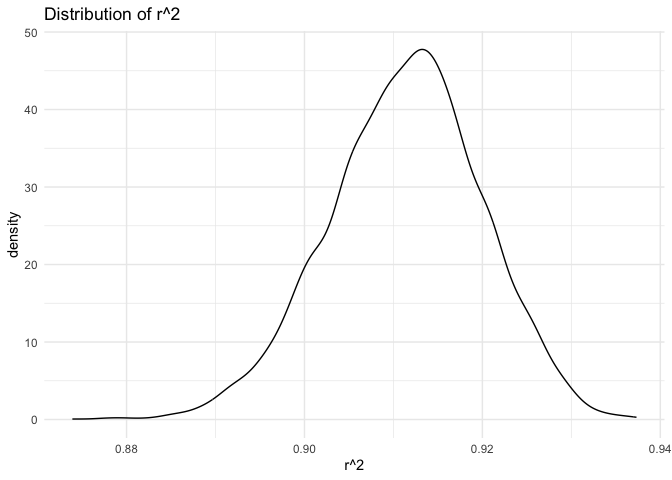

Homework6
================
David
2024-11-17

## Problem 1

Import weather data.

``` r
weather_df = 
  rnoaa::meteo_pull_monitors(
    c("USW00094728"),
    var = c("PRCP", "TMIN", "TMAX"), 
    date_min = "2017-01-01",
    date_max = "2017-12-31") |>
  mutate(
    name = recode(id, USW00094728 = "CentralPark_NY"),
    tmin = tmin / 10,
    tmax = tmax / 10) |>
  select(name, id, everything())
```

    ## using cached file: /Users/david/Library/Caches/org.R-project.R/R/rnoaa/noaa_ghcnd/USW00094728.dly

    ## date created (size, mb): 2024-09-26 10:20:13.126901 (8.651)

    ## file min/max dates: 1869-01-01 / 2024-09-30

Estimate R squared and Log beta product in each bootstrapping data.

``` r
boot_results =
  weather_df |> 
  modelr::bootstrap(n = 5000) |> 
  mutate(
    models = map(strap, \(df) lm(tmax ~ tmin, data = df)),
    metrics = map(models, \(model) {
      r_squared = glance(model)$r.squared
      coef = tidy(model)
      beta0 = coef$estimate[coef$term == "(Intercept)"]
      beta1 = coef$estimate[coef$term == "tmin"]
      log_beta_product = log(beta0 * beta1)
      tibble(r_squared = r_squared, log_beta_product = log_beta_product)
    })
  ) |> 
  select(metrics) |> 
  unnest(metrics)
```

Drawing distribution of R squared and Log beta product in each
bootstrapping data.

``` r
boot_results |>
ggplot(aes(x = r_squared)) +
  geom_density() +
  ggtitle("Distribution of r^2") +
  xlab("r^2") +
  theme_minimal()
```

<!-- -->

``` r
boot_results |>
ggplot(aes(x = log_beta_product)) +
  geom_density() +
  ggtitle("Distribution of log(beta0 * beta1)") +
  xlab("log(beta0 * beta1)") +
  theme_minimal()
```

<!-- -->

The above plot shows the distribution of R squared and Log beta product,
which all resemble a beel shape similar to normal distribution.

Showing 95% CI of R squared and Log beta product:

``` r
boot_results |>
  reframe(
    ci = c("Lower", "Higher"),
    r_squared = quantile(r_squared, probs = c(0.025, 0.975)),
    log_beta_product = quantile(log_beta_product, probs = c(0.025, 0.975))
  ) |>
  knitr::kable(
    col.names = c("95%CI", "R Sqaured", "Log Beta Product")
  )
```

| 95%CI  | R Sqaured | Log Beta Product |
|:-------|----------:|-----------------:|
| Lower  | 0.8936684 |         1.964949 |
| Higher | 0.9271060 |         2.058887 |

## Problem 2

Import and tidy data.

``` r
homicide = read_csv("homicide-data.csv") |>
  janitor::clean_names()
```

    ## Rows: 52179 Columns: 12
    ## ── Column specification ────────────────────────────────────────────────────────
    ## Delimiter: ","
    ## chr (9): uid, victim_last, victim_first, victim_race, victim_age, victim_sex...
    ## dbl (3): reported_date, lat, lon
    ## 
    ## ℹ Use `spec()` to retrieve the full column specification for this data.
    ## ℹ Specify the column types or set `show_col_types = FALSE` to quiet this message.

Clean the data to satisfy the need of analysis.

``` r
homicide =
  homicide |>
  mutate(city_state = paste(city, state, sep = ",")) |>
  filter(
    !city_state %in% c("Dallas,TX", "Phoenix,AZ", "Kansas City,MO", "Tulsa,AL"),
    victim_race %in% c("White", "Black"),
  ) |>
  mutate(
    victim_age = as.numeric(victim_age),
    victim_sex = as.factor(victim_sex),
    victim_race = as.factor(victim_race),
    disposition = as.factor(case_when(
      disposition %in% c("Closed without arrest", "Open/No arrest") ~ "unsolved",
      disposition %in% c("Closed by arrest") ~ "solved"
    ))
  ) |>
  drop_na(victim_age)
```

    ## Warning: There was 1 warning in `mutate()`.
    ## ℹ In argument: `victim_age = as.numeric(victim_age)`.
    ## Caused by warning:
    ## ! NAs introduced by coercion

Calculate OR in Baltmore about victim’s sex.

``` r
homicide |>
  filter(city_state == "Baltimore,MD") |>
  glm(disposition ~ victim_age + victim_sex + victim_race, data = _, family = "binomial") |>
  broom::tidy() |>
  filter(   
    term == "victim_sexMale"
  ) |>
  mutate(
    OR = exp(estimate),
    lower_ci = exp(estimate - 1.96 * std.error),
    upper_ci = exp(estimate + 1.96 * std.error)
  ) |>
  select(term, OR, lower_ci, upper_ci) |>
  knitr::kable(
    col.names = c("Comparison", "OR", "Lower CI", "Upper CI")
  )
```

| Comparison     |       OR | Lower CI | Upper CI |
|:---------------|---------:|---------:|---------:|
| victim_sexMale | 2.350112 | 1.792547 | 3.081104 |

Making a plot demonstrating OR in victim’s sex across cities.

``` r
homicide =
  homicide |>
  group_by(city_state) |>
  nest() |>
  mutate(
    models = map(data, \(df) glm(disposition ~ victim_age + victim_sex + victim_race, data = df, family = "binomial")),
    results = map(models, broom::tidy)
  ) |>
  select(-data, -models) |>
  unnest(results)

homicide |>
  filter(   
    term == "victim_sexMale"
  ) |>
  mutate(
    OR = exp(estimate),
    lower_ci = exp(estimate - 1.96 * std.error),
    upper_ci = exp(estimate + 1.96 * std.error)
  ) |> 
  ggplot(aes(x = fct_reorder(city_state, OR), y = OR, ymin = lower_ci, ymax = upper_ci)) +
  geom_pointrange() +
  geom_hline(yintercept = 1.0, linetype = "dashed", color = "red") +
  coord_flip() +
  theme_minimal() +
  labs(
    title = "Estimated Odds Ratios and 95% Confidence Intervals by City",
    x = "City",
    y = "Odds Ratio (OR)"
  )
```

<!-- -->

New York has the highest OR in victim sex disparity while Albuquerque
has the lowest. Male suffer a higher risk of being victim in most cities
except Nashville,TN, Fresno,CA, Stockton,CA and Albuquerque,NM. However,
these OR, even though below 1.0, hold no significance at 95%
significance level.

## Problem 3

Import and clean the dataset.

``` r
birth_data = read_csv("birthweight.csv") |>
  janitor::clean_names() |>
  mutate(
    babysex = as.factor(babysex),
    frace = as.factor(frace),
    malform = as.factor(malform),
    mrace = as.factor(mrace),
  ) |>
  drop_na()
```

    ## Rows: 4342 Columns: 20
    ## ── Column specification ────────────────────────────────────────────────────────
    ## Delimiter: ","
    ## dbl (20): babysex, bhead, blength, bwt, delwt, fincome, frace, gaweeks, malf...
    ## 
    ## ℹ Use `spec()` to retrieve the full column specification for this data.
    ## ℹ Specify the column types or set `show_col_types = FALSE` to quiet this message.

Declaring the proposed and two alternative models

``` r
model_a = lm(bwt ~ momage + ppbmi + wtgain + smoken + babysex + gaweeks + malform + gaweeks:smoken, data = birth_data)
model_b = lm(bwt ~ blength + gaweeks, data = birth_data)
model_c = lm(bwt ~ bhead * blength * babysex, data = birth_data)
```

Drawing prediction against residuals in the first model.

``` r
birth_data |>
  add_predictions(model_a) |>
  add_residuals(model_a) |>
  ggplot(aes(x = pred, y = resid)) +
  geom_point(alpha = 0.5) +
  geom_hline(yintercept = 0, linetype = "dashed", color = "red") +
  theme_minimal() +
  labs(
    title = "Residuals vs. Fitted Values",
    x = "Predicted Birthweight",
    y = "Residuals"
  )
```

<!-- -->

Make comparison in terms of the cross-validated prediction error.

``` r
cv_data =
  crossv_mc(birth_data, n = 100) |>
  mutate(
    train = map(train, as_tibble),
    test = map(test, as_tibble))

cv_data =
  cv_data |>
  mutate(
    model_a = map(train, \(df) lm(bwt ~ momage + ppbmi + wtgain + smoken + babysex + gaweeks + malform + gaweeks:smoken, data = df)),
    model_b = map(train, \(df) lm(bwt ~ blength + gaweeks, data = df)),
    model_c = map(train, \(df) lm(bwt ~ bhead * blength * babysex, data = df))) |> 
  mutate(
    rmse_a = map2_dbl(model_a, test, \(mod, df) rmse(model = mod, data = df)),
    rmse_b = map2_dbl(model_b, test, \(mod, df) rmse(model = mod, data = df)),
    rmse_c = map2_dbl(model_c, test, \(mod, df) rmse(model = mod, data = df)))

cv_data |> 
  select(starts_with("rmse")) |> 
  pivot_longer(
    everything(),
    names_to = "model", 
    values_to = "rmse",
    names_prefix = "rmse_") |> 
  mutate(model = fct_inorder(model)) |> 
  ggplot(aes(x = model, y = rmse)) +
  geom_violin() +
  theme_minimal() +
  labs(
    title = "RSME of Three Models",
    x = "Different Models",
    y = "RMSE"
  )
```

<!-- -->

a as the proposed model, b as the first alternative, c as the second
alternative.

As the plot demonstrates, model c, the second alternative model, has the
lowest rmse, which represents the best performance among three models.
